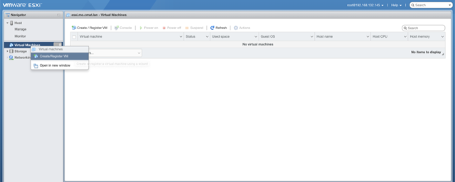

# CAPES

## Create the CAPES Virtual Machine
- Right-Click on `Virtual Machines` and select `Create/Register VM`  
  
  - Name: `CAPES`  
  - Compatibility: Leave default  
  - Guest OS Family: `Linux`  
  - Guest OS Version: `Red Hat Enterprise Linux 7 (64-bit)`  
- Click `Next` to create new virtual machine
- Select your storage  
- Customize the VM  
  - CPU: `2`  
  - Memory: `3 GB`,  Reserved
  - Hard disk 1: `500 GB`  
  - SCSI Controller 0: Leave default  
  - SATA Controller 0: Leave default  
  - USB controller 1:  Leave default  
  - Network Adapter: `Passive`, ensure that `Connect` is enabled  
  - CD/DVD Drive 1: `Datastore ISO file`, select the RHEL ISO you uploaded above, ensure that `Connect` is enabled  
  - Video Card:  Leave default  
- Review your settings  
- Click Finish
There are 2 version of CAPES

V1 - Bare Metal
- [CAPES Version 1](../topics/capes/v1/README.md)

V2 - Container
- [CAPES Version 2](../topics/capes/v2/README.md)
