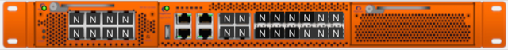

# Gigamon Configuration

Before you start, ensure that your Gigamon is [properly racked](../hardware-assembly.md)

# Initial Configuration (Console)

- With a Mac or Linux system, connect a Console cable to the Console port of the Gigamon  

  

> Console port highlighted purple

- Connect your Console cable and go into your Terminal program (Terminal, iTerm, etc.)
```
ls /dev/*usb*
crw-rw-rw-  1 root  wheel   20, 115 Nov 29 15:06 /dev/cu.usbserial-A105LRRY (this could be slightly different on your system)
crw-rw-rw-  1 root  wheel   20, 114 Nov 29 15:06 /dev/tty.usbserial-A105LRRY (this could be slightly different on your system)
sudo cu -l /dev/cu.usbserial-A105LRRY -s 115200
```
> If you are using a different console access program, the following parameters are needed:

```
Baud Rate: 115,200
Data Bits: 8
Parity: None
Stop Bits: 1
Flow Control: None
```
- This will ask you to log in with the [default credentials](../credentials.md)
- As soon as you log in, you'll be asked to enter the `Initial Configuration`, let's do that.

> Note: You need to change the hostnames, octets, and insert your passwords from the [Platform Management page](../platform-management.md) before inputting this into the Gigamon.

A good suggestion is to perform a "Find" for `[` and replace the `[comment]` with your specific environment variables.

```
Gigamon GigaVUE-OS

GigaVUE-OS configuration wizard

Do you want to use the wizard for initial configuration? yes

- Hostname: tap.[state].cmat.lan
- Management Interface <eth0> : eth0
- Use DHCP on eth0 interface: no
- Use zeroconf on eth0 interface: no
- Primary IPv4 address and masklen: 10.[state].10.5/24
- Default gateway: 10.[state].10.1
- Primary DNS server: 10.[state].10.20
- Domain name: cmat.lan
- Enable IPv6: no
- Enable secure cryptography: no
- Enable secure passwords: yes
- Minimum password length: 16
- Admin password: [password from Platform Management]
- Cluster enable: no
- Box-id for the chassis: 1

To change an answer, enter the step number to return to.
Otherwise hit <enter> to save changes and exit.
```
- Hit enter to save your configuration
- You'll be presented with a summary of your configuration changes. You can go back and make any adjustments as necessary.  
- If you decided not to change your default passphrase, you can do so in the webUI  
- If you decided to change your default passphrase, I **strongly** recommend you hop over to the webUI and make sure you can log in  

> In the event that your passphrase isn't working, you should reset here before you logout of the console

```
tap.[state].cmat.lan > enable
tap.[state].cmat.lan # configure terminal
tap.[state].cmat.lan (config) # username admin|monitor|operator password
```

# Initial Configuration (WebUI)
- Connect a network cable to the management port on the front of the Gigamon


> Management port highlighted purple  

- Set your local IP address to be in the same network as the management IP you configured above.
- Point your browser to the management IP you set above. See the [platform management](../platform-management.md) page for exact address and credentials.

## Enabling Interfaces
It should be noted, these next steps...are silly. Don't blame us.

- Once you're logged in, click on the `Chassis` from the toolbar on the left

- You will notice that the interfaces are not configured and it is not inherently obvious how to enable them.

  

> Unconfigured Gigamon interfaces

- You can either right-click on the image and select `Configure` or switch from "Chassis View" to "List View" and then select your interfaces and `Configure` them.

  

  

> Configuration options for the interfaces

- Your interfaces should all have come up as Network Ports



> Configured Gigamon interfaces

## Port Types
Packets arrive at the Gigamon Visibility Platform at network ports and are directed to monitoring and analysis tools connected to tool ports by flow maps.

### Network (Ingress) Ports
**Network ports** are where you connect data sources to GigaVUE nodes. For example, you could connect a switch’s SPAN port, connect an external TAP, or simply connect an open port on a hub to an open port on a line card. Regardless, the idea is the same – network ports are where data arrives at the GigaVUE node.

> Note:	In their standard configuration, network ports only accept data input – no data output is allowed.

### Tool (Egress) Ports
**Tool ports** are where you connect destinations for the data arriving on network ports on GigaVUE nodes. For example, an IT organization could assign one set of tool ports to its Security Team for an intrusion detection system, a forensic data recorder, and a traditional protocol analyzer while a separate set of tool ports assigned to the Application Performance Management team is used for a flow recorder and a long-term packet capture device. Regardless of the specific tool connected, the idea is the same – tool ports are where users select different portions of the data arriving on network ports.

> Note:	Tool ports only allow data output to a connected tool. Any data arriving at the tool port from an external source will be discarded. In addition, a tool port’s Link Status must be up for packets to be sent out of the port.

Deployment Scenarios:
- [ER Span Tunnel Config](./topics/gigamon/erspan.md)
- [Inline Tap Config](./topics/gigamon/inline_tap.md)
- [Normal SPAN port from local switch](./topics/gigamon/span_termination.md)

Move onto [Networking Configuration](/topics/network/network-layout.md)
