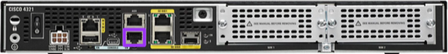
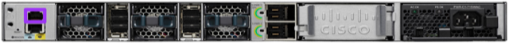
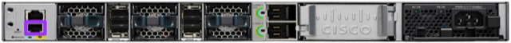

# Network Configuration

Before you start, ensure that your switch and router are [properly racked](../hardware-assembly.md)

# Initial Router Configuration
## Console
With a Mac or Linux system, connect a Console cable to the Console port of the router  
  
> Console port highlighted purple

Connect your Console cable and go into your Terminal program (Terminal, iTerm, etc.)
```
ls /dev/*usb*
crw-rw-rw-  1 root  wheel   20, 115 Nov 29 15:06 /dev/cu.usbserial-A105LRRY (this could be slightly different on your system)
crw-rw-rw-  1 root  wheel   20, 114 Nov 29 15:06 /dev/tty.usbserial-A105LRRY (this could be slightly different on your system)
sudo cu -l /dev/cu.usbserial-A105LRRY -s 9600
```
> If you are using a different console access program, the following parameters are needed:

```
Baud Rate: 9600
Data Bits: 8
Parity: None
Stop Bits: 1
Flow Control: None
```

As soon as you connect, you'll be given some basic instructions on how to change the default username and passphrase. So let's do that.

Remember, the credential pairs are stored in the [platform-management page](../platform-management.md). Replace `[username]` and `[passphrase]` with the proper pair from the [platform-management page](../platform-management.md).

```
User Access Verification
Username: [default username]
Password: [default password]
Router# config t
Router(config)# username [username] privilege 15 secret 0 [password]
```

You can copy and paste the provided configuration into the router console. You need to change the hostnames, octets, and insert your passwords from the [Platform Management page](../platform-management.md) before inputting this into the router.

>NOTE: A good suggestion is to perform a "Find"  in the configuration for `[` and replace the `[comment]` with your specific environment variables.

For Specific Configuration examples see the [Router](../router/README.md) Configuration

The entire running configuration is stored in the [config directory](../../config/router-config.txt).

# Initial Switch Configuration
## Console
With a Mac or Linux system, connect a Console cable to the Console port of the switch  
  
> Console port highlighted purple

Connect your Console cable and go into your Terminal program (Terminal, iTerm, etc.)
```
ls /dev/*usb*
crw-rw-rw-  1 root  wheel   20, 115 Nov 29 15:06 /dev/cu.usbserial-A105LRRY (this could be slightly different on your system)
crw-rw-rw-  1 root  wheel   20, 114 Nov 29 15:06 /dev/tty.usbserial-A105LRRY (this could be slightly different on your system)
sudo cu -l /dev/cu.usbserial-A105LRRY -s 9600
```
> If you are using a different console access program, the following parameters are needed:

```
Baud Rate: 9600
Data Bits: 8
Parity: None
Stop Bits: 1
Flow Control: None
```

As soon as you connect, you'll be given some basic instructions on how to change the default username and passphrase. So let's do that.

Remember, the credential pairs are stored in the [platform-management page](../platform-management.md).

Replace `[username]` and `[passphrase]` with the proper pair from the [platform-management page](../platform-management.md).

```
User Access Verification
Username: [default username]
Password: [default password]
Router# config t
Router(config)# username [username] privilege 15 secret 0 [password]
```

The entire running configuration is stored in the [config directory](../../config/switch.config).

You can copy and paste the provided configuration into the switch console. You need to change the hostnames, octets, and insert your passwords from the [Platform Management page](../platform-management.md) before inputting this into the router. A good suggestion is to perform a "Find"  in the configuration for `[` and replace the `[comment]` with your specific environment variables.

The entire running configuration is stored in the [config directory](../../config/switch-config.txt).

For Specific Configuration examples see the [Switch](../switch/README.md) Configuration

## Initial Switch Configuration (WebUI)
- Connect a network cable to the management port on the front of the switch

> Management port highlighted purple  

- Set your local IP address to be in the same subnet as the management IP you configured above  

- Point your browser to the management IP from the [Platform Management page](../platform-management.md) page  


Move onto [Dell Server R840 Configuration](../dell/README.md)
or **if** installed,
