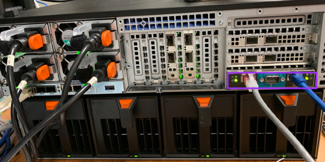
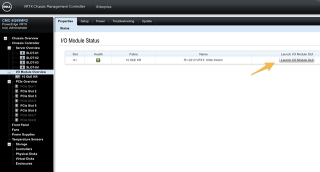
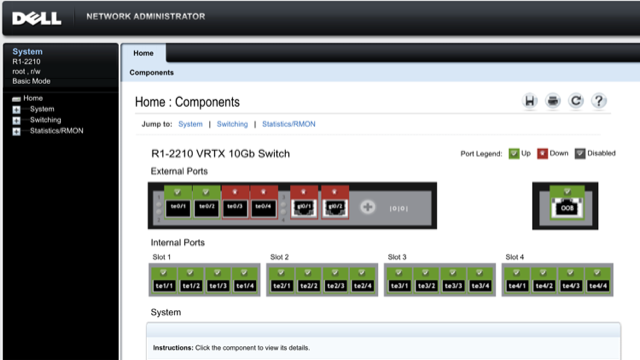
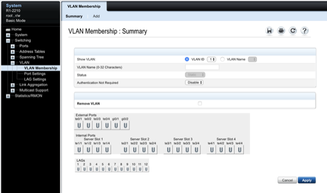
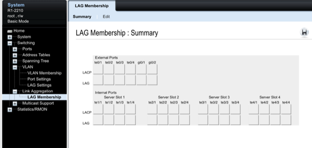
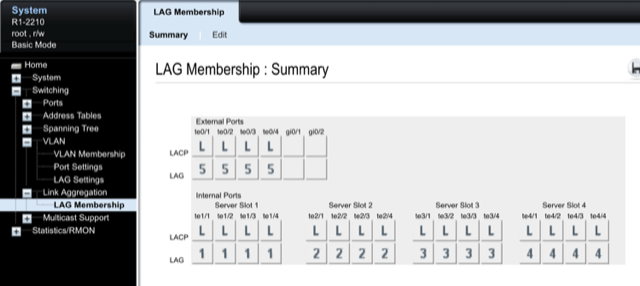
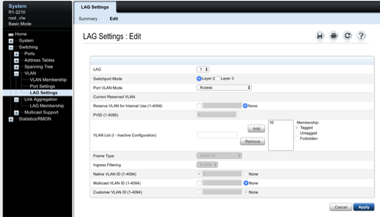
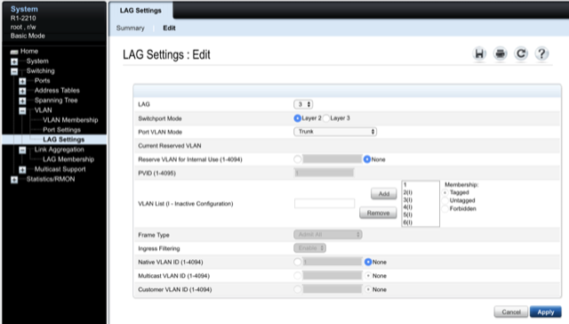
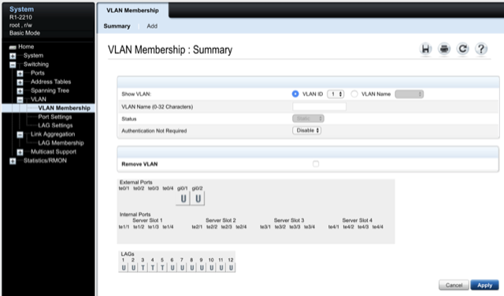

# Dell Chassis Management Controller (CMC) Configuration

If you have not already done so, press the chassis power button to turn it on. The LCD screen displays a series of initialization screens as it turns on. When it is ready, the Language Setup screen is displayed.

# Initial Configuration (LCD Panel)
- Select a language from the options in the dialog box. The following message is displayed on the enclosure screen: `Configure Enclosure?`
- Press the center button to continue to the `CMC Network Settings` screen.
- Configure the CMC network settings for your environment:
- Network speed `1000`
- Duplex mode `Auto`
- Network mode `static`
- Static IP address, subnet mask, and gateway values [refer to the Platform Management page](../platform-management.md)
- DNS settings [refer to the Platform Management page](../platform-management.md)

# Initial Configuration (WebUI)
- Connect a network cable to one of the management ports on the back of the CMC.

> Note: There are redundant management interfaces. Either one will work. If you only have one plugged in, you'll get a warning when you log into the WebUI, but it isn't a problem. To make the warning go away, plug the CMC into [an appropriate switch port in VLAN10](../hardware-assembly.md).

> Management port highlighted purple  

- Set your local IP address to be in the same subnet as the management IP you configured above.
- Point your browser to the management IP you set above. See the [Platform Management](../platform-management.md) page for exact address and credentials.
- Login with the default credentials stored on the [Platform Management page](../platform-management.md). This will bring you to the Dell switch home screen.

In the CMC, go to the I/O Module Overview. In the line for the `R1-2210 VRTX 10Gb Switch`, click the `Launch I/O Module GUI`.

 Configuration

If you have not already done so, press the chassis power button to turn it on. The LCD screen displays a series of initialization screens as it turns on. When it is ready, the Language Setup screen is displayed.

# Initial Configuration (LCD Panel)
- Select a language from the options in the dialog box. The following message is displayed on the enclosure screen: `Configure Enclosure?`
- Press the center button to continue to the `CMC Network Settings` screen.
- Configure the CMC network settings for your environment:
- Network speed `1000`
- Duplex mode `Auto`
- Network mode `static`
- Static IP address, subnet mask, and gateway values [refer to the Platform Management page](../platform-management.md)
- DNS settings [refer to the Platform Management page](../platform-management.md)

# Initial Configuration (WebUI)
- Connect a network cable to one of the management ports on the back of the CMC.

> Note: There are redundant management interfaces. Either one will work. If you only have one plugged in, you'll get a warning when you log into the WebUI, but it isn't a problem. To make the warning go away, plug the CMC into [an appropriate switch port in VLAN10](../hardware-assembly.md).

> Management port highlighted purple  

- Set your local IP address to be in the same subnet as the management IP you configured above.
- Point your browser to the management IP you set above. See the [Platform Management](../platform-management.md) page for exact address and credentials.
- Login with the default credentials stored on the [Platform Management page](../platform-management.md). This will bring you to the Dell switch home screen.

In the CMC, go to the I/O Module Overview. In the line for the `R1-2210 VRTX 10Gb Switch`, click the `Launch I/O Module GUI`.

## Add VLANs

Expand in the sidebar to `Switching -> VLAN -> VLAN Membership`. Then click `Add` to create new VLANs on the switch.

Add the following VLANs:

| VLAN  | Description |
|-------|-------------|
| 10    | Internal    |
| 20    | Active      |

## Create Link Aggregation Groups (LAGs)

Create LAG groups with LACP for each of the internal server slots, and also the external 10G ports. This should result in a configuration that looks like the following:

## Configure VLAN Trunking and Access ports

The LAG for the sensor blades (1 and 2) will be access ports in VLAN 10. You have to remove VLAN 1 from the VLAN list first; you can set it to 10. The resulting configuration should look like this.

The LAG for the hypervisor blades and external LAG will operate in trunk mode with no native VLANs.

The result summary should look like the following.

> Note:: You can change the VLAN in this view to see the settings per each VLAN. `T` means that VLAN will be tagged on that port. `U` means it will be untagged on that port. Blank means it is an access port in that VLAN. A trunk port should have all the VLANs that you wish to pass with a setting of `T`.

Move onto [Software Deployment](../software_overview/software-deployment.md)  
ng)

## Add VLANs

Expand in the sidebar to `Switching -> VLAN -> VLAN Membership`. Then click `Add` to create new VLANs on the switch.

Add the following VLANs:

| VLAN  | Description |
|-------|-------------|
| 10    | Internal    |
| 20    | Active      |

## Create Link Aggregation Groups (LAGs)

Create LAG groups with LACP for each of the internal server slots, and also the external 10G ports. This should result in a configuration that looks like the following:

## Configure VLAN Trunking and Access ports

The LAG for the sensor blades (1 and 2) will be access ports in VLAN 10. You have to remove VLAN 1 from the VLAN list first; you can set it to 10. The resulting configuration should look like this.

The LAG for the hypervisor blades and external LAG will operate in trunk mode with no native VLANs.

The result summary should look like the following.

> Note:: You can change the VLAN in this view to see the settings per each VLAN. `T` means that VLAN will be tagged on that port. `U` means it will be untagged on that port. Blank means it is an access port in that VLAN. A trunk port should have all the VLANs that you wish to pass with a setting of `T`.

Move onto [Software Deployment](../software_overview/software-deployment.md)  
