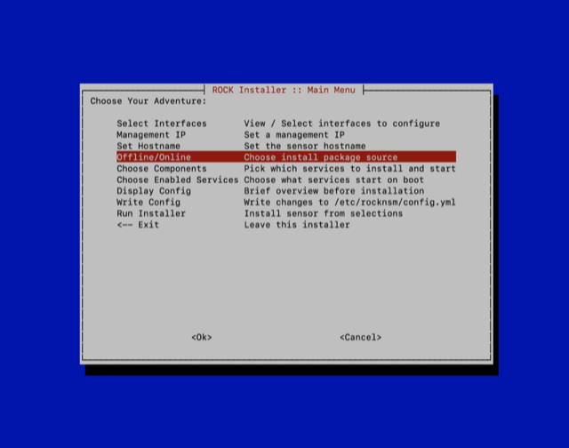
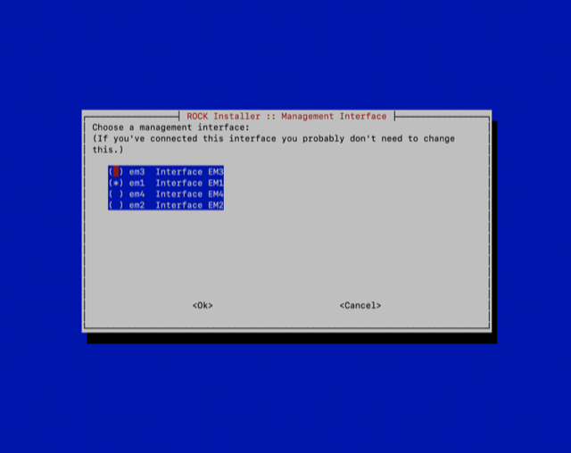
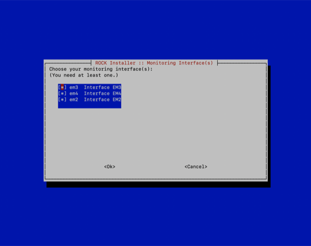
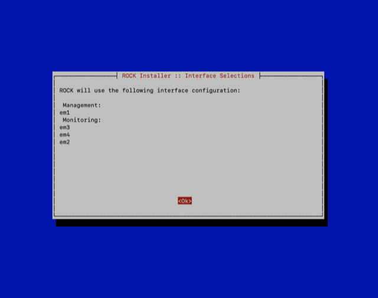
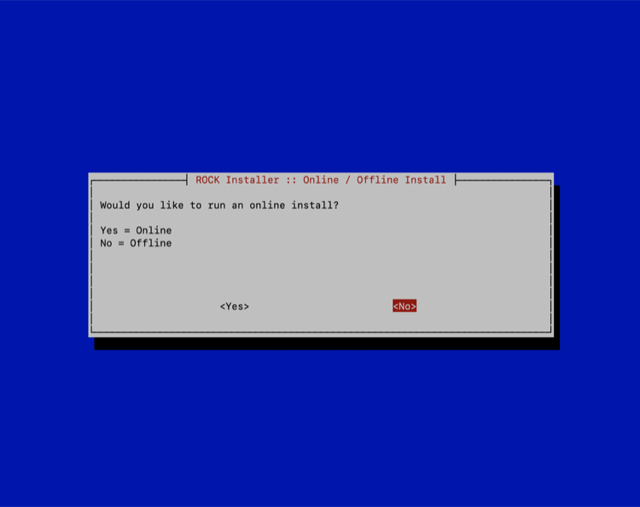
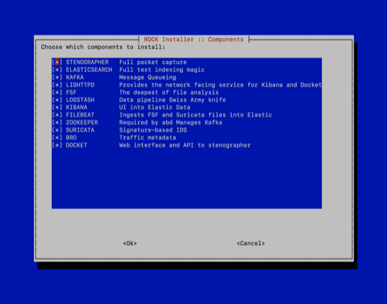
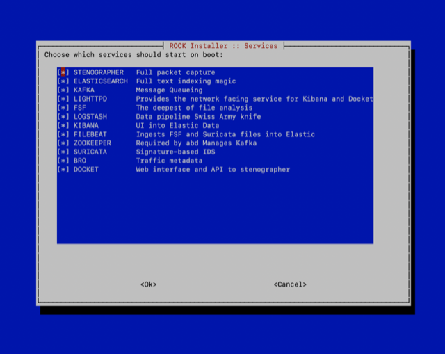

# RockNSM Deployment
This will cover the deployment of the RockNSM sensor/data node elements. This installation is for the ROCKNSM iso.

## Prereqs
 - ESXi installed
 -  login ability to log in and ssh into every system
 - DNS Setup
 - Connectivity of all servers
### Install OS
> NOTE: add flags to Anaconda Preinstall **IF** any of the nodes are Virtual Machines

When you boot the installer, called Anaconda. Before it boots, press the interrupt key and append the following, which disables physical NIC naming and sets the screen resolution that is better for VMware.

  `net.ifnames=0 vga=791 biosdevname=0`

Install CENTOS in accordance with RHEL Documentation

---

#### Disable FIPS to allow Deployment on all components
> NOTE: if you didn't DISA STIG the machine, then you do not need to do this.

- Disable FIPS

  - Remove the dracut-fips* packages
  ```
  sudo yum remove dracut-fips\*
  ```

  - Backup existing FIPS initramfs
  ```
  sudo mv -v /boot/initramfs-$(uname -r).img{,.FIPS-bak}
  ```

  - Run dracut to rebuild the initramfs
  ```
  sudo dracut
  ```

  - Run Grubby
  ```
  sudo grubby --update-kernel=ALL --remove-args=fips=1
  ```

  - Carefully up date the grub config file setting fips=0
  ```
  sudo vi /etc/default/grub
  ```

  - Reboot the VM
  ```
  sudo reboot
  ```

  - Log back in

  - Confirm that FIPS is disabled by
  ```
  sysctl crypto.fips_enabled
  ```
If it returns 0, then it has been properly disabled

#### Sync the Clocks across all machines
Due to the nature of virtual machines, we have to keep the VMs and Baremetal equipment in sync. We set the sensor as the authority for time for the rest of the kit. We do this for a couple of reasons, the biggest being that it is where the time-based data is generated from Zeek(Bro), FSF, and Suricata. Aligning the rest of the stack along this guideline keeps us from writing events in the future. All events should be written in UTC to help with the response across timezones. All of this is done via chrony.

> NOTE: If you have any time-based services that are running, turn them off. Otherwise, continue if this a new installation as we have not deployed ROCK yet.

- If not already installed then install chrony
```
sudo yum install chrony
```

- Edit the config file with `vi`
```
sudo vi /etc/chrony.conf
```

- **Time Server (Likely Sensor)** Uncomment/edit the following line in the `/etc/chrony.conf`
```
allow 10.[state].10.0/24  
```

- Add ntp to the firewall on sensor
```
sudo firewall-cmd --add-service=ntp --zone=work --permanent
```

- Reload the firewall
```
sudo firewall-cmd --reload
```

- **Time Client (Everything not the Sensor Server)** Uncomment all the time servers and point it to `sensor.[state].cmat.lan` or the IP address.
```
server 192.0.2.1 iburst
```

- Start and enable the service.
```
sudo systemctl enable --now chronyd
```

- Add ntp to the firewall on sensor
```
sudo firewall-cmd --add-service=ntp --zone=work --permanent
```

- Reload the firewall
```
sudo firewall-cmd --reload
```
- Verify on all the applicable clients that they can talk to the server for time.
```
chronyc sources
```

#### Mount the iso
For all the installation machines, mount the iso. Transfer the contents to each of the machines.

-  Download the iso from the nuc if you have it there already.

-   Mount the iso if you have not already done so to `/mnt`
```
mount -t iso9660 -o loop path/to/image.iso /mnt
```

-  Copy the folders form the mounted device to `/srv/rocknsm`
```
cp -r /mnt/* /srv/rocknsm/.
```

#### Deployment of Rock across All Machines
> NOTE: The new playbooks in 2.4.0 are made to handle multi-node deployments. We will be able to deploy several machines at the same time.
Generate a hosts.ini file that so ansible knows where to deploy things sudo vi /etc/rocknsm/hosts.ini

> NOTE: If not already done, then log into every server that rock will be deployed so that the key can be added to the ssh hosts file.

- Insert the following text. These will tell the script what to deploy and where


```
sensor.[state].cmat.lan ansible_host=10.[state].10.21 ansible_connection=local
es1.[state].cmat.lan ansible_host=10.[state].10.25 ansible_connection=local
es2.[state].cmat.lan ansible_host=10.[state].10.26 ansible_connection=local
es3.[state].cmat.lan ansible_host=10.[state].10.27 ansible_connection=local
# If you have any other sensor or data nodes then you would place them in the list above.


[rock]
sensor.[state].cmat.lan

[web]
es1.[state].cmat.lan

[sensors:children]
rock

[bro:children]
sensors

[fsf:children]
sensors

[kafka:children]
sensors

[stenographer:children]
sensors

[suricata:children]
sensors

[zookeeper]
sensor.[state].cmat.lan

[elasticsearch:children]
es_masters
es_data
es_ingest

[es_masters]
es[1:3].[state].cmat.lan

[es_data]
es[1:3].[state].cmat.lan

[es_ingest]
es[1:3].[state].cmat.lan

[elasticsearch:vars]
# Disable all node roles by default
node_master=false
node_data=false
node_ingest=false

[es_masters:vars]
node_master=true

[es_data:vars]
node_data=true

[es_ingest:vars]
node_ingest=true

[docket:children]
web

[kibana:children]
web

[logstash:children]
sensors
```

### Hotfixes for iso

- Change Directory into `usr/share/rock/bin`

- remove/comment the following steps in the following playbook files:
  - for adding entries to the /etc/hosts `/usr/share/rock/roles/common/tasks/configure.yml`
  - disable and enable shard allocation in `/usr/share/rock/roles/elasticsearch/tasks/restart.yml`
  - ensure that you edit the playbook in `/etc/elasticsearch/elastisearch.yml` and change
   `es_node_name: "{{ ansible_hostname }}"` to `{{ inventory_hostname }}`
  - comment out the step `update-suricata source index` in the file `/usr/share/rock/roles/suricata/tasks/main.yml`

- Run `sudo ./rock ssh-config` to setup ssh on all the hosts you will use for the deployment. It uses the host from the previously created `host.ini`. Or just log into each machine.

- Disable/move the local repo to make sure everything comes from the mounted iso if it is already present.
```
sudo mv /etc/yum.repos.d/local-repos.repo ~/
```


- In the `/etc/elasticsearch/elasticsearch.yml` file Change `discovery.zen.ping.unicast.hosts` to `discovery.seed_hosts`. Configure this setting on all Nodes as follows:
```
discovery.seed_hosts: ["es1.[state].cmat.lan", "es2.[state].cmat.lan", "es3.[state].cmat.lan"]
```

### Back to the normal Installation
Most of the Rock configuration is now automated and can be called from anywhere on the os. Below are the options. Run `sudo rock ssh-config` to setup all the hosts before deploying.

```
[admin@sensor ~]$ sudo rock help
Usage: /sbin/rock COMMAND [options]
Commands:
setup               Launch TUI to configure this host for deployment
tui                 Alias for setup
ssh-config          Configure hosts in inventory to use key-based auth (multi-node)
deploy              Deploy selected ROCK components
deploy-offline      Same as deploy --offline (Default ISO behavior)
deploy-online       Same as deploy --online
stop                Stop all ROCK services
start               Start all ROCK services
restart             Restart all ROCK services
status              Report status for all ROCK services
genconfig           Generate default configuration based on current system
destroy             Destroy all ROCK data: indexes, logs, PCAP, i.e. EVERYTHING
                      NOTE: Will not remove any services, just the data

Options:
--config, -c <config_yaml>         Specify full path to configuration overrides
--extra, -e <ansible variables>    Set additional variables as key=value or YAML/JSON passed to ansible-playbook
--help, -h                         Show this usage information
--inventory, -i <inventory_path>   Specify path to Ansible inventory file
--limit <host>                     Specify host to run plays
--list-hosts                       Outputs a list of matching hosts; does not execute anything else
--list-tags                        List all available tags
--list-tasks                       List all tasks that would be executed
--offline, -o                      Deploy ROCK using only local repos (Default ISO behavior)
--online, -O                       Deploy ROCK using online repos
--playbook, -p <playbook_path>     Specify path to Ansible playbook file
--skip-tags <tags>                 Only run plays and tasks whose tags do not match these values
--tags, -t <tags>                  Only run plays and tasks tagged with these values
--verbose, -v                      Increase verbosity of ansible-playbook
```
- Setup you ssh access to your machine using sudo rock ssh-config command or using sudo rock tui for the Text user interfaces

- Start the interactive text interface for setup using `sudo rock tui`


- Select "Select Interfaces". This allows you to choose which interface you will manage and capture with.



- Choose your management interface



- Choose your capture interface(s).



> NOTE: Any interface you set for capture will spawn a Bro/Zeek, Suricata, and FSF process. So if you don't intend on using the interface, do not set it for capture.

- You will then be forwarded to the interface summary screen. make sure all the things are to your satisfaction



- Once it has returned to the installation setup screen, choose the  "Offline/Online" installation option. This tells the installation playbook where to pull the packages. As these kits are meant to be offline, we will choose the offline installation option.


- Choose "No" for the offline installation.



- Once it has returned to the installation setup screen, then choose the  "Choose Components" installation option.


- Here is where you decide what capabilities your sensor will have. If you are low on resources, the recommendation is to disable docket and stenographer. Otherwise, just enable everything.




- Once it has returned to the installation setup screen, then choose the  "Choose enabled services" installation option. This needs to match the installed components unless you have a specific reason to do so.



- This will write the config to the ansible deployment script.

- Once it has returned to the installation setup screen, then choose the  "Run Installer" installation option.


**It should complete with no errors**


- Ensure the following ports on the firewall are open for the data nodes

  - 9300 TCP - Node coordination (I am sure elastic has a better name for this)
  - 9200 TCP - Elasticsearch
  - 5601 TCP - Only on the Elasticsearch node that has Kibana installed, Likely es1.[STATE].cmat.lan
  - 22 TCP - SSH Access
  ```
  sudo firewall-cmd --add-port=9300/tcp --permanent
  ```

- Reload the firewall-config
```
sudo firewall-cmd --reload
```

- Ensure the following ports on the firewall are open for the sensor
  - 1234 tcp/udp - NTP
  - 22 TCP - SSH Access
  - 9092 TCP - Kafka
  ```
  sudo firewall-cmd --add-port=22/tcp --permanent
  ```

- Reload the firewall-config
```
sudo firewall-cmd --reload
```

- Check the Suricata `threads` per interface. This is so Suricata doesn't compete with bro for cpu threads in `etc/suricata/rock-overrides.yml`
```
%YAML 1.1
---
default-rule-path: "/var/lib/suricata/rules"
rule-files:
  - suricata.rules

af-packet:
  - interface: em4
    threads: 4   <--------
    cluster-id: 99
    cluster-type: cluster_flow
    defrag: yes
    use-mmap: yes
    mmap-locked: yes
    #rollover: yes
    tpacket-v3: yes
    use-emergency-flush: yes
```


- Restart services with `sudo rock stop` and the `sudo rock start`

Move onto [USAGE](../rocknsm-usage.md)
