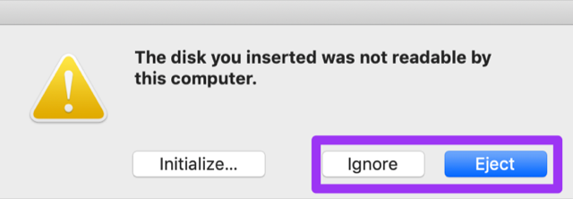
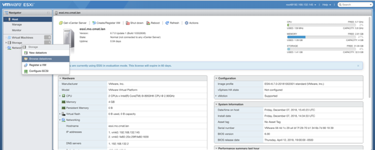
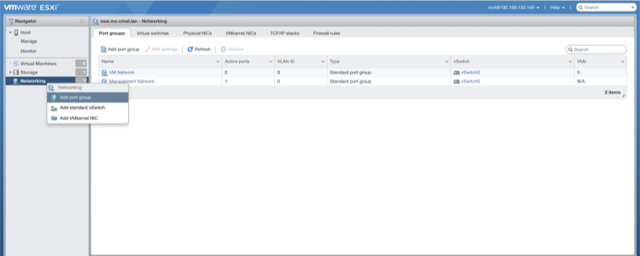

# VMWare ESXi Configuration

Before you start, ensure that your server is [properly racked](../hardware-assembly.md)

VMware ESXi is a purpose-built bare-metal hypervisor that installs directly onto a physical server. With direct access to and control of underlying resources, ESXi is more efficient than hosted architectures and can effectively partition hardware to increase consolidation ratios.

# Install ESXi

## Collect ESXi

Download ESXi from the VMWare portal.

Now it's time to create a bootable USB drive with that fresh ESXi build.  Let's look at a few options.   

### CLI

If you live in the terminal, use `dd` to apply the image.  These instructions are for using a terminal in macOS.  If you're in a different environment, Google is your friend.  

:warning: Take CAUTION when using these commands by ENSURING you're writing to the correct disk/partition! :warning:

- once you've inserted a USB, get the drive ID:  
`diskutil list`  

- unmount the target drive so you can write to it:  
`diskutil unmountDisk /dev/disk#`  

- write the image to drive:  
`sudo dd bs=8M if=path/to/esxi.iso of=/dev/disk#`  

If this is done on a Mac, you could get a popup once the operation is complete asking you to `Initialize, Ignore, Eject` the disk. You want to `Ignore` or `Eject`. `Initialize` will add a partition to it that will allow Mac to read the disk and make it unbootable.  
  

### Via GUI

**MacOS:**  if using the terminal is currently a barrier to getting things rolling, [etcher.io](https://www.balena.io/etcher/) is an excellent GUI burning utility.  
**Windows:**  there are several great tools to apply a bootable image in MS land, but we recommend [rufus](https://rufus.akeo.ie/).  

## Installation Instructions

- Load the ESXi installer media in a physical or virtual drive on your host machine and restart the host machine  
- Set the BIOS to boot from the media  
- Select the ESXi installer in the boot menu and press Enter  
- To accept the EULA, press `F11`  
- Select the `OS` drive on which to install ESXi and press Enter  
- To select the default keyboard layout for the host, press Enter  
- To set the host password in accordance with the [Platform Management](../platform-management.md) page  
- To begin installation, press `F11`  
- After the installation finishes, remove the installation media and press Enter to restart the host

# Post Installation Configuration

- After the system reboots, you will be at the default ESXi landing page  
- Press `F2` and log in as `root` and use your passphrase stored on the [Platform Management](../platform-management.md) page  
- Go down to `Configure Management Network`  
- Go down to `IPv4 Configuration`  
- Ensure that `Set static IPv4 address and network configuration` is set (you can toggle it by selecting it and pressing the `Space` bar)  
- Enter the `IPv4 Address`, `Subnet Mask`, and `Default Gateway`, and press `Enter`
- Go down and select `DNS Configuration`  
- Enter your DNS and hostname information from the [Platform Management](../platform-management.md) page and press `Enter`  
- Press `ESC`, then `Y` to save your changes and restart your management interface  
- Go down and select `Test Management Network` and ping your gateway IP from the [Platform Management](../platform-management.md) page to validate the settings  
- Press `ESC` to log out  

# Upload Media to Datastore
> Note: this could be a bit different, specifically around the Storage considerations. I recommend you update the documentation with your specific environment.  

- Point your browser to `https://esxi1.[STATE].cmat.lan` from the [Platform Management](../platform-management.md) page  
- Log in with your user credential pair from the [Platform Management](../platform-management.md) page  
- Right-click on `Storage` and select `Browse datastores`  
  
- Click on `Create directory` and make a new directory called `iso`  
  - Click on the new `iso` folder and click `Upload`  
  - Upload your RHEL, when that's done, click `Close`  

# Create Networking Ports
- On the Configure tab, expand Networking and select Virtual switches.
Click Add host networking.
- Select a connection type for which you want to use the new standard switch and click Next.
- Add physical network adapter `vmnic0`.
Virtual Machine Port Group for a Standard Switch
- Click OK.
- Right-Click on `Networking` and select `Add port group`  
  
- Enter the following:
  - Name: `Passive`  
  - VLAN ID: `10`  
  - Virtual switch: `vSwitch0`  
  - Security: `Inherit from vSwitch`  
- Enter the following:
  - Name: `Management`  
  - VLAN ID: `10`  
  - Virtual switch: `vSwitch0`  
  - Security: `Inherit from vSwitch`  
- Enter the following:
  - Name: `Active`  
  - VLAN ID: `20`  
  - Virtual switch: `vSwitch0`  
  - Security: `Inherit from vSwitch`  

Move onto [DNS](../dns/README.md)
